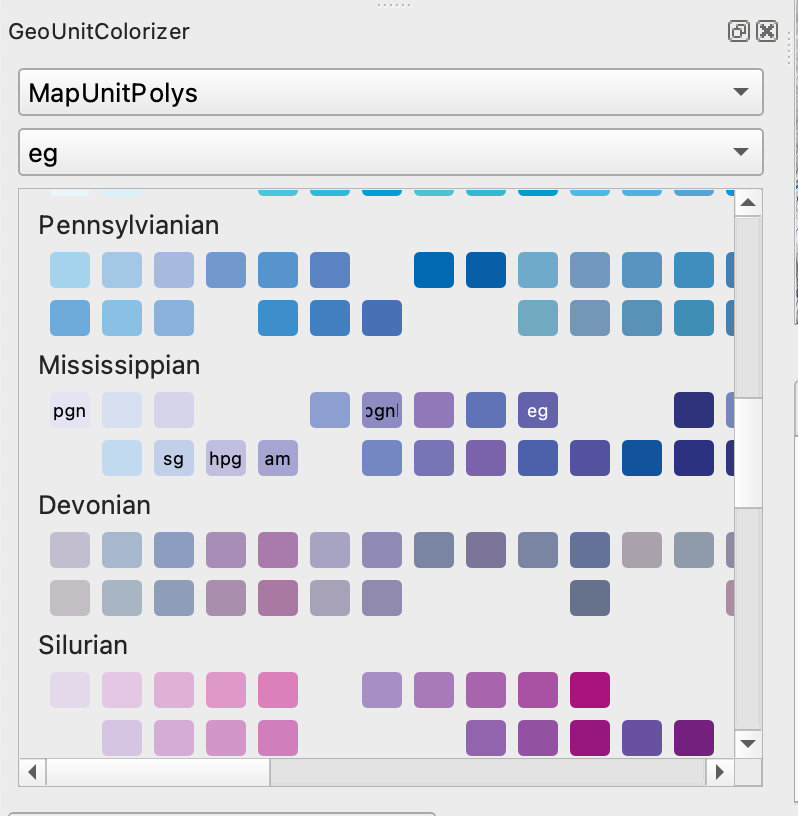

GeoUnitColorizer
================

QGIS Plugin to color Geologic Units based on the [USGS Color and Patterns](https://pubs.usgs.gov/tm/2005/11B01/05tm11b01.html)

Description
-----------
Quickly apply fill colors to polygons within a map layer without going through the styling dialog.  Colors are based on those
defined by the [USGS Color and Patterns](https://pubs.usgs.gov/tm/2005/11B01/05tm11b01.html).  They are defined by Unit Age 
and shade.

License
-------

BSD 2-Clause 
